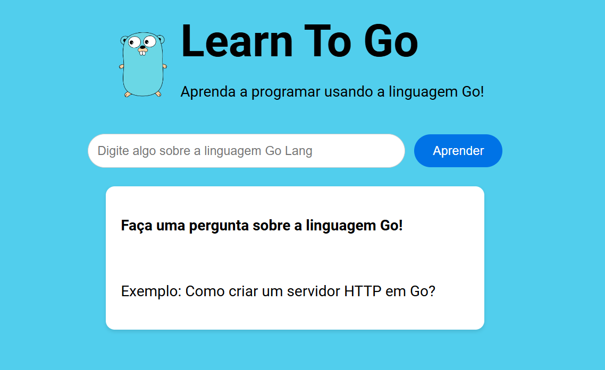

# ✨ Alura Imersão Dev com Google Gemini

## 🎯 Objetivo

O objetivo da Imersão Dev é aprender a programar usando o auxilio do Google Gemini através da pagina de prompts do Google.

Com o Gemini você pode criar prompts de pesquisas e gerar respostas para elas, o que pode ser útil para quem está começando a aprender a programar.

Neste projeto tive a ideia de ir além e criei uma aplicação que permite que você crie prompts de pesquisas e gere respostas para elas sobre a linguagem de programação Go.

## Demonstração

[](https://www.youtube.com/watch?v=-YvusW0YUgQ "Demo - Alura Imersão Dev - Learn To Go")

## 📝 Descrição

Este projeto se chama **Learn To Go**, que contem em seu nome um trocadilho que significa "Aprenda a ir!", ou seja, aprenda a ir além e crie programas que te ajudarão a ir mais longe e se destacar como um profissional de tecnologia utilizando Go.

## 📦 Tecnologias

Este projeto foi desenvolvido utilizando as seguintes tecnologias:

- HTML
- CSS
- JavaScript

## 📊 Requisitos

Para utilizar o projeto será necessário uma API Key do Google Gemini. Se você não tiver uma chave, você pode criar uma [aqui](https://aistudio.google.com/app/apikey).

**ATENÇÃO:** Essa chave é de uso único e não será armazenada em nenhum lugar, ou seja, se você recarregar a página, deverá inserir a chave novamente.

## 🌐 Acesse o projeto

Você pode acessar o projeto abrindo a página em seu navegador:
```bash
https://alura.jsfelipearaujo.com/
```

## 🚀 Como executar localmente

Para executar este projeto, siga os passos abaixo:

1. Clone o repositório:

```bash
git clone https://github.com/jfelipearaujo/alura-imersao-dev-gemini.git
```

2. Utilize a extensão [Live Server](https://marketplace.visualstudio.com/items?itemName=ritwickdey.LiveServer) do Visual Studio Code para executar o projeto localmente.

3. Abra o seu navegador e acesse a URL do servidor local:

```bash
http://localhost:5500
```

4. Quando você acessar a página, você verá uma caixa de diálogo para inserir sua API Key do Google Gemini.

## 📄 Licença

Esse projeto está sob a licença MIT. Veja o arquivo [LICENSE](LICENSE) para mais detalhes.

## 📝 Autor

* **Jose Felipe Araújo** - [LinkedIn](https://www.linkedin.com/in/jsfelipearaujo/)

## 🙌🏻 Agradecimentos

* Ao [Guilherme Lima](https://www.linkedin.com/in/guilherme-lima-developer/).
* A [Rafaella Ballerini](https://www.linkedin.com/in/rafaellaballerini/).
* Ao [Luciano Martins](https://www.linkedin.com/in/lucianommartins/).
* A [Alura](https://www.alura.com.br/) por fornecer o espaço para este projeto.
* Ao [Google](https://www.google.com/) por fornecer o serviço de geração de prompts de pesquisas com o Google Gemini.